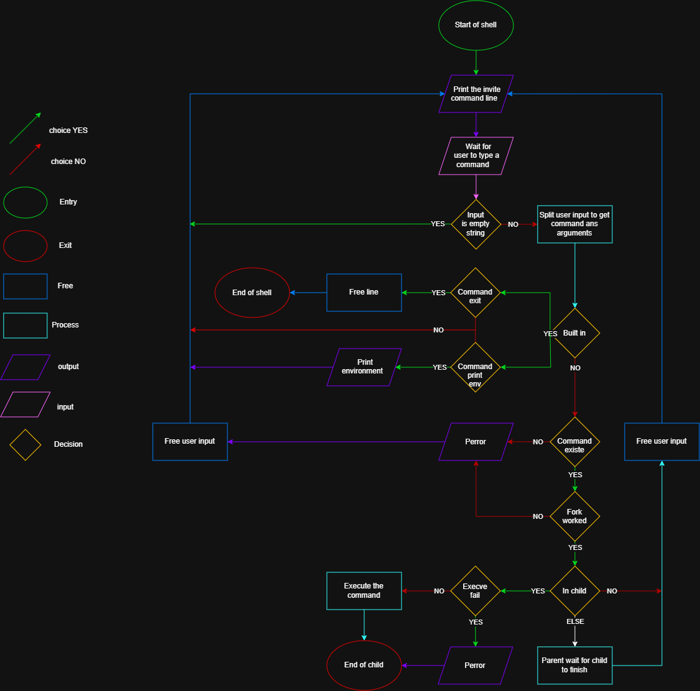

# Simple Shell

A simple UNIX command line interpreter, built as a replica of `sh`, the Bourne shell.

## Description

Simple Shell is a command line interpreter written in C. It reads a command typed by the user, searches for it in the directories listed in the `PATH` environment variable, and executes it in a child process. It works both in interactive mode (with a prompt) and in non-interactive mode (reading commands from a pipe or a file).

## Learning Objectives

- How does a shell work
- What is a pid and a ppid
- How to manipulate the environment of the current process
- What is the difference between a function and a system call
- How to create processes
- What are the three prototypes of main
- How does the shell use the PATH to find the programs
- How to execute another program with the execve system call
- How to suspend the execution of a process until one of its children terminates
- What is EOF / "end-of-file"?

## Compilation

The project is compiled with:

```
gcc -Wall -Werror -Wextra -pedantic -std=gnu89 *.c -o simple_shell
```

## Initial Flowchart



## Usage

```
./simple_shell
```

Interactive mode:

```
$ ./simple_shell
($) /bin/ls
simple_shell main.c simple_shell.h
($) exit
$
```

Non-interactive mode:

```
$ echo "/bin/ls" | ./simple_shell
simple_shell main.c simple_shell.h
```

The prompt only shows up in interactive mode. On end of file (`Ctrl+D`), the shell exits with the exit status of the last command executed.

## Built-in commands

* `exit` - exits the shell
* `env` - prints the current environment

## Files

| File | Description |
| --- | --- |
| `simple_shell.c` | Entry point, contains `main` and the main loop of the shell |
| `simple_shell.h` | Header file with all function prototypes |
| `prompt.c` | Displays the prompt and reads a line typed by the user |
| `extract_command_args.c` | Splits the user input into an array of arguments |
| `find_path.c` | Searches for a command in the directories listed in `PATH` |
| `create_child.c` | Creates a child process and executes the command with `execve` |
| `free_argv.c` | Frees the array of arguments |
| `built-in.c` | Implementation of the built-in commands (`exit`, `env`) |

## How it works

1. The shell displays a prompt and reads a line from standard input.
2. The line is split into an array of arguments (the command and its options).
3. If the command is a built-in (`exit`, `env`), it is executed directly by the parent process.
4. Otherwise, the shell looks for the command:
   * if it contains a `/`, it is used as is;
   * otherwise, the shell searches every directory listed in the `PATH` environment variable.
5. If the command is found, the shell creates a child process with `fork`, and the child replaces its own image with the command using `execve`.
6. The parent process waits for the child to finish with `wait`, and keeps its exit status to use it as the shell's own exit status.
7. The loop repeats until the user types `exit` or sends an end-of-file (`Ctrl+D`).

## Environment

The shell does not implement its own environment. It only reads the environment passed to `main` and uses it, unchanged, to find and execute commands.

## Authors

Project developed by Jean de Foucault-Lebel and Bryce Vermorel as part of the Holberton program.
